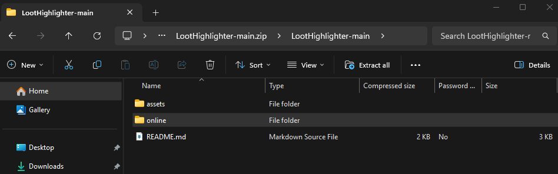
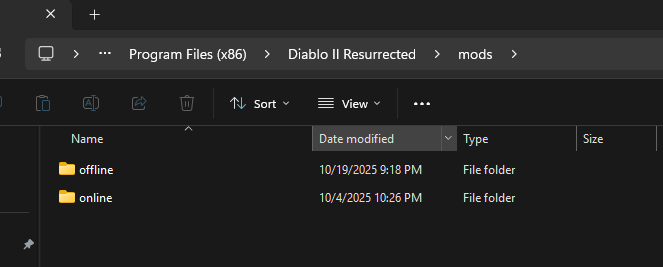

# Loot Highlighter

- [Purpose](#purpose)
- [Disclaimer](#disclaimer)
- [Examples](#examples)
- [How To](#how-to)

## Purpose

This is a loot highlighter or "loot filter" for d2r. I wanted to make a way to get something akin to a loot filter from POE or PD2. I wanted to do it without any other programs, or full blown mods. Just modifying a few files, and the launch command.

## Disclaimer

Even though I am confident this is unintrusive. It could still get you banned theoretically. The only files which are modified are the "local" strings for some text, and the methods are completely builtin, and overriding the base files are built in to D2R. Blizzard could argue it still violates TOS.

## Examples

### "Highlighting"

First, the beautiful juicy bits. Look at this beautiful high rune. I have not looked into where or how to enable the shiny light ground effect. This may also be in one of the local folders that I would deem safe. Might look into it in the future.

Some bases which could be white, etheriel, superior, and/or socketed could be really good. I have added the color red, to the second half of these items. seen below. This does mean, however, that an item which is rare, unique, or magic, will not FULLY be that color. The first half will be blue, yellow, or gold, while the second-half remains red. There are ways which other mods get around this. But it does not follow the purpose of this "mod" which is to be minimally invasive, and as least pervasive to being online.

Here is another example. This one I find really shows why this mod is important. I always see people complaining about finding Monarchs. I find them all the dang time. I believe it is because of this highlighting that allows me to quickly find them in groups.

### "Supressing"

I supress very little. In this meaning of "Supressing": The item is still there, but it is fully white, and usually the text is condensed.

Below is an example of suppressed items, which are still highlighted. You will easily be able to pick out Full Mana Potions with them being minimally invasive.

All runes have their rune level, and some degree of highlighting, with increasingly more pizazz up to Zod.

## How To

Read the [Disclaimer](#disclaimer).

You must also be at least a tiny bit tech savvy. I wont handhold how to unzip files, or copy folders from one place to another.

For those who are uninitiated, the process being outlined below is how you "create a mod". This is how all the other tools do it, but they do it for you. You are doing this manually.

1. Download this repository as a zip. Alternately, you could download the files individually, but they must end up in the correct relative location.

2. I am going to be demonstrating the download as a zip method for those who are the least tech savvy.

3. On this repository you will see a dropdown for downloading as a zip. See below.

4. Go to your downloads folder, and find the zip. You don't even need to extract the contents. Click in until you see the "online" folder. Image below.

5. Copy that folder.

6. Find the installation path for D2R. For me it is below. If there isn't a mods folder, create it now.

7. Inside that mods folder. Paste the folder mentioned in step 4. See below. Notice I have an offline version myself, you wouldn't and thats fine.

### Finally, 
we need to tell the blizzard launcher where to find those text files.

8. So open the launcher, and click the Launch Settings Cog, followed by Game Settings. See below.

9. Ensure the checkbox is checked seen below. and add the launch commands to load the txt file versions of our "mod".

### Closing

That should be it. If there are any issues don't hesitate to reach out to me on github here.
You should be able to load the game, and take a look at a few items and runes and see if they are displaying differently.